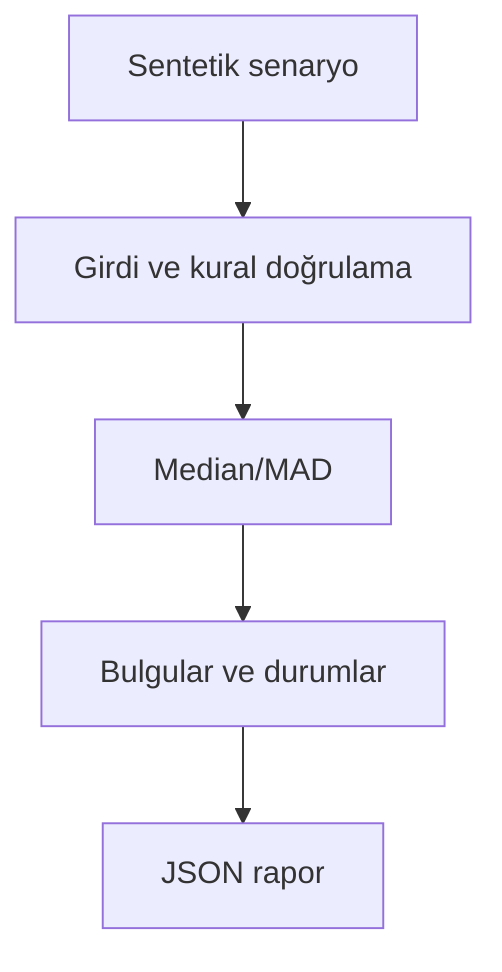

# Mimari

Haftalık dalgalanmayı gerçek işlem hatası gibi işaretlemeden kalıcı sapmaları saptamak.

Asıl alan akışı: **Frozen seasonal baseline → robust residual → EWMA → 2-of-3 vote**. CLI JSON yükler, çekirdek `run(config)` alan motorunu çağırır ve JSON seri hale getirir. Veritabanı kullanan örnekler geçici dizinde izole edilir; kalıcı sınıflar doğrudan çağrılırken dosya yolu dışarıdan verilir.

## İnvariant ve başarısızlık sınırı

Baseline warmup boyunca oluşur; izleme sırasında otomatik güncellenmez.

Eşikler demo içindir; saha verisinde yanlış alarm bütçesiyle doğrulanmalıdır.

Her hata kararı makine tarafından okunabilir çıktı veya açık exception üretir. Geçersiz yapılandırma sessizce düzeltilmez. Olası tekrarların güvenliği ilgili çekirdeğin kabul kurallarına bağlıdır; bütün projelere ortak bir retry uygulanmaz.
