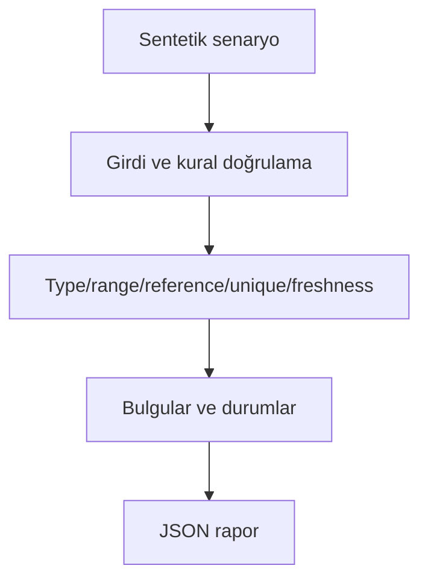

# Mimari

Şema ve veri hatalarının downstream raporlara sessizce girmesini engellemek.

Asıl alan akışı: **Row contract checks → duplicate/freshness → quarantine → release gate → PSI**. CLI JSON yükler, çekirdek `run(config)` alan motorunu çağırır ve JSON seri hale getirir. Veritabanı kullanan örnekler geçici dizinde izole edilir; kalıcı sınıflar doğrudan çağrılırken dosya yolu dışarıdan verilir.

## İnvariant ve başarısızlık sınırı

Bilinmeyen alan REVIEW; geçersiz satır BLOCK; kabul edilen ve karantinadaki satırlar ayrılır.

PSI kategorik histogram karşılaştırmasıdır; kendi başına istatistiksel anlamlılık testi değildir.

Her hata kararı makine tarafından okunabilir çıktı veya açık exception üretir. Geçersiz yapılandırma sessizce düzeltilmez. Olası tekrarların güvenliği ilgili çekirdeğin kabul kurallarına bağlıdır; bütün projelere ortak bir retry uygulanmaz.
