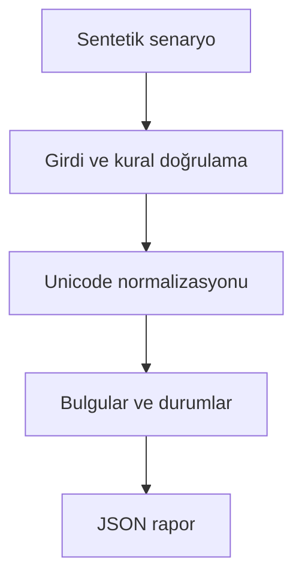

# Mimari

Benzer müşteri adlarını birleştirirken çelişkili vergi kimliklerinin dolaylı birleşmesini önlemek.

Asıl alan akışı: **Country/name blocking → pair similarity → sorted edges → cluster tax-id gate**. CLI JSON yükler, çekirdek `run(config)` alan motorunu çağırır ve JSON seri hale getirir. Veritabanı kullanan örnekler geçici dizinde izole edilir; kalıcı sınıflar doğrudan çağrılırken dosya yolu dışarıdan verilir.

## İnvariant ve başarısızlık sınırı

Küme seviyesinde en fazla bir dolu vergi kimliği; boş kimlik eşleşmeyi tek başına engellemez.

Tam adres ve dil çözümlemesi yoktur; eşikler etiketli gerçek çiftlerle doğrulanmalıdır.

Her hata kararı makine tarafından okunabilir çıktı veya açık exception üretir. Geçersiz yapılandırma sessizce düzeltilmez. Olası tekrarların güvenliği ilgili çekirdeğin kabul kurallarına bağlıdır; bütün projelere ortak bir retry uygulanmaz.
