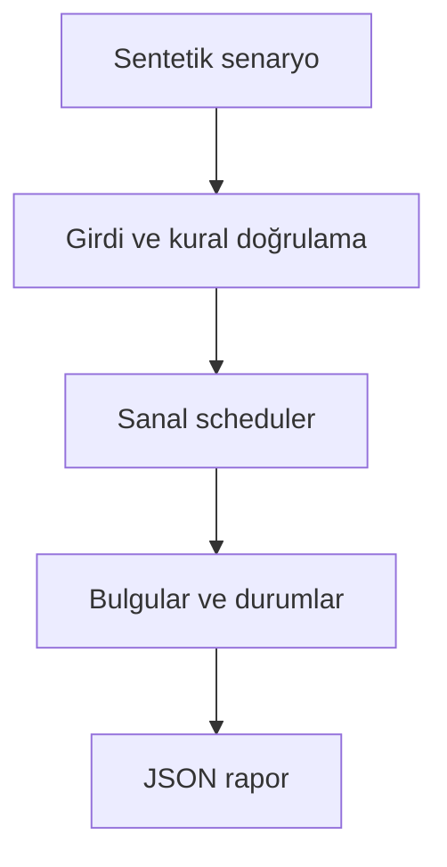

# Mimari

Başarısız ön koşuldan sonraki testleri atlamak ve tekrarın yan etkisini kontrol etmek.

Asıl alan akışı: **DAG cycle check → bounded workers → attempt completion → retry/skip → gate**. CLI JSON yükler, çekirdek `run(config)` alan motorunu çağırır ve JSON seri hale getirir. Veritabanı kullanan örnekler geçici dizinde izole edilir; kalıcı sınıflar doğrudan çağrılırken dosya yolu dışarıdan verilir.

## İnvariant ve başarısızlık sınırı

Retry yalnız idempotent veya idempotency_key içeren görevlerde açılır.

Yerel sanal görevlerdir; gerçek HTTP transport ve JUnit adaptörü bu sürümde yoktur.

Her hata kararı makine tarafından okunabilir çıktı veya açık exception üretir. Geçersiz yapılandırma sessizce düzeltilmez. Olası tekrarların güvenliği ilgili çekirdeğin kabul kurallarına bağlıdır; bütün projelere ortak bir retry uygulanmaz.
