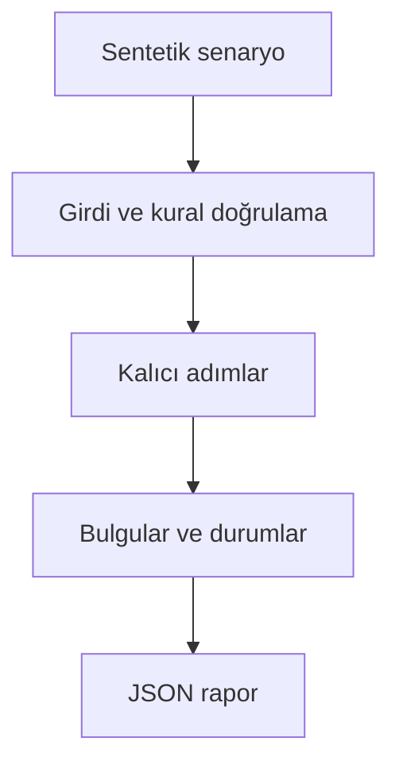

# Mimari

Stok/ödeme/kargo zincirinde çöken koordinatörü yeniden başlatmak ve güvenli telafi etmek.

Asıl alan akışı: **Inventory → payment → shipping → completion; failure → compensation/manual**. CLI JSON yükler, çekirdek `run(config)` alan motorunu çağırır ve JSON seri hale getirir. Veritabanı kullanan örnekler geçici dizinde izole edilir; kalıcı sınıflar doğrudan çağrılırken dosya yolu dışarıdan verilir.

## İnvariant ve başarısızlık sınırı

Katılımcılar order+step anahtarlı kalıcı yerel mock; kargo gerçekleşmişse manuel inceleme gerekir.

Gerçek dağıtık transaction yoktur; remote katılımcı idempotency ve outbox gereklidir.

Her hata kararı makine tarafından okunabilir çıktı veya açık exception üretir. Geçersiz yapılandırma sessizce düzeltilmez. Olası tekrarların güvenliği ilgili çekirdeğin kabul kurallarına bağlıdır; bütün projelere ortak bir retry uygulanmaz.
