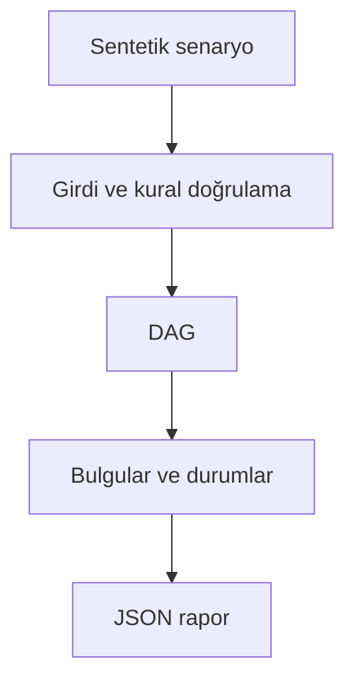

# Mimari

Yüksek riskli gereksinimlerin güncel test kanıtı olmadan sürüme çıkmasını engellemek.

Asıl alan akışı: **Graph validation → descendants → fresh passing tests → weighted coverage → release gate**. CLI JSON yükler, çekirdek `run(config)` alan motorunu çağırır ve JSON seri hale getirir. Veritabanı kullanan örnekler geçici dizinde izole edilir; kalıcı sınıflar doğrudan çağrılırken dosya yolu dışarıdan verilir.

## İnvariant ve başarısızlık sınırı

Her gereksinimden erişilebilen güncel başarılı test kapsama sayılır.

Bağlantının iş anlamını insan doğrular; grafik tek başına test kalitesini ispatlamaz.

Her hata kararı makine tarafından okunabilir çıktı veya açık exception üretir. Geçersiz yapılandırma sessizce düzeltilmez. Olası tekrarların güvenliği ilgili çekirdeğin kabul kurallarına bağlıdır; bütün projelere ortak bir retry uygulanmaz.
