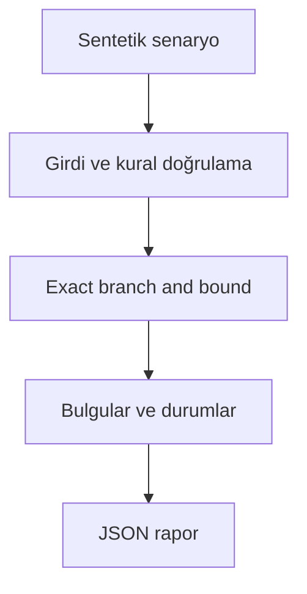

# Mimari

Birden fazla kaynak bütçesinde en kötü senaryo değerini en yükseğe çıkaran proje setini bulmak.

Asıl alan akışı: **Budget validation → include/exclude search → scenario upper bound → dependency gate**. CLI JSON yükler, çekirdek `run(config)` alan motorunu çağırır ve JSON seri hale getirir. Veritabanı kullanan örnekler geçici dizinde izole edilir; kalıcı sınıflar doğrudan çağrılırken dosya yolu dışarıdan verilir.

## İnvariant ve başarısızlık sınırı

Değerler ve maliyetler negatif olamaz; en fazla 26 aday; hedef min(scenario totals).

NP-hard arama büyük portföyde pahalıdır; süre sınırlı MILP çözümü ayrıca gerekir.

Her hata kararı makine tarafından okunabilir çıktı veya açık exception üretir. Geçersiz yapılandırma sessizce düzeltilmez. Olası tekrarların güvenliği ilgili çekirdeğin kabul kurallarına bağlıdır; bütün projelere ortak bir retry uygulanmaz.
