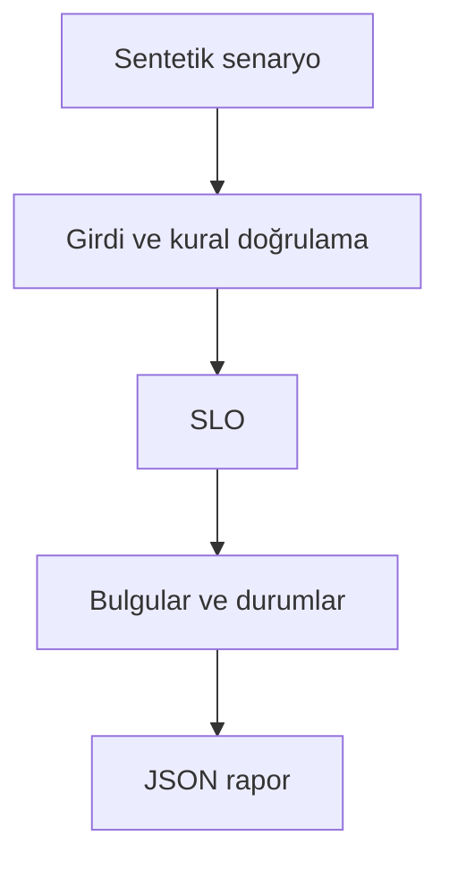

# Mimari

Kısa süreli küçük örneklem sıçraması ile kalıcı hizmet bozulmasını ayırmak.

Asıl alan akışı: **Time window selection → error rates → budget burn → minimum volume → combined page**. CLI JSON yükler, çekirdek `run(config)` alan motorunu çağırır ve JSON seri hale getirir. Veritabanı kullanan örnekler geçici dizinde izole edilir; kalıcı sınıflar doğrudan çağrılırken dosya yolu dışarıdan verilir.

## İnvariant ve başarısızlık sınırı

Pencereler now-window < at <= now; alarm tüm pencerelerde eşik aşılınca açılır.

Uzun dönem hata bütçesi ayrıca tutulmalıdır; remaining değeri son pencerenin bütçesidir.

Her hata kararı makine tarafından okunabilir çıktı veya açık exception üretir. Geçersiz yapılandırma sessizce düzeltilmez. Olası tekrarların güvenliği ilgili çekirdeğin kabul kurallarına bağlıdır; bütün projelere ortak bir retry uygulanmaz.
