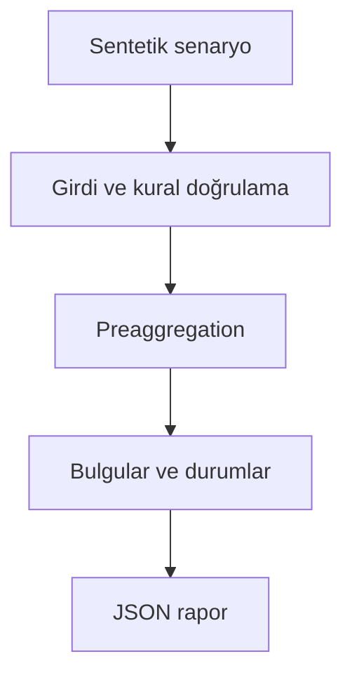

# Mimari

Daha hızlı görünen SQL değişikliğinin tutarları katlamasını sonuç doğruluğuyla yakalamak.

Asıl alan akışı: **Synthetic relational data → independent expected totals → SQL comparison → explain → median timings**. CLI JSON yükler, çekirdek `run(config)` alan motorunu çağırır ve JSON seri hale getirir. Veritabanı kullanan örnekler geçici dizinde izole edilir; kalıcı sınıflar doğrudan çağrılırken dosya yolu dışarıdan verilir.

## İnvariant ve başarısızlık sınırı

Para tamsayı; iki ticket join fanout hatasını bilerek gösterir; sürelerden önce doğruluk değerlendirilir.

SQLite yerel ölçümüdür; PostgreSQL planlarına veya gerçek üretim yüküne genellenmez.

Her hata kararı makine tarafından okunabilir çıktı veya açık exception üretir. Geçersiz yapılandırma sessizce düzeltilmez. Olası tekrarların güvenliği ilgili çekirdeğin kabul kurallarına bağlıdır; bütün projelere ortak bir retry uygulanmaz.
