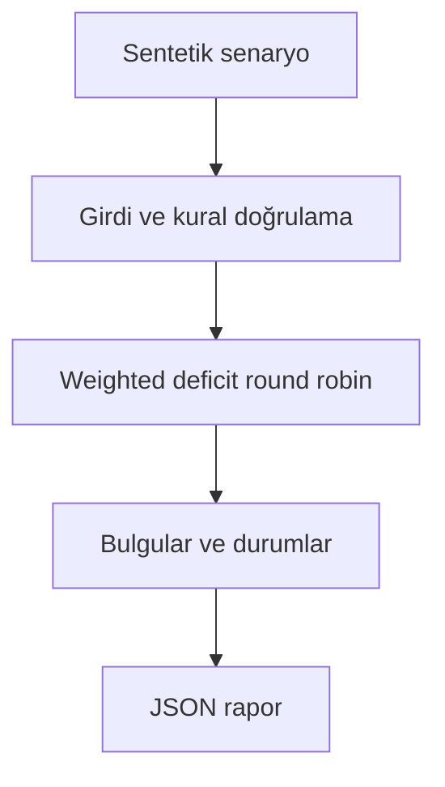

# Mimari

Bir tenantın pahalı işlerinin diğerlerinin kuyruğunu tek başına tüketmesini önlemek.

Asıl alan akışı: **Tenant queues → quantum credit → non-preemptive dispatch → weighted service report**. CLI JSON yükler, çekirdek `run(config)` alan motorunu çağırır ve JSON seri hale getirir. Veritabanı kullanan örnekler geçici dizinde izole edilir; kalıcı sınıflar doğrudan çağrılırken dosya yolu dışarıdan verilir.

## İnvariant ve başarısızlık sınırı

Tüm işler başlangıçta hazırdır; adalet tamamlanan maliyet üzerinden ölçülür.

Canlı varış, öncelik yaşlandırma ve tenant rate cap bu sürümde bulunmaz.

Her hata kararı makine tarafından okunabilir çıktı veya açık exception üretir. Geçersiz yapılandırma sessizce düzeltilmez. Olası tekrarların güvenliği ilgili çekirdeğin kabul kurallarına bağlıdır; bütün projelere ortak bir retry uygulanmaz.
